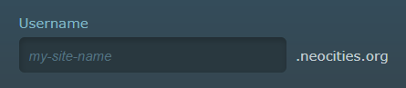
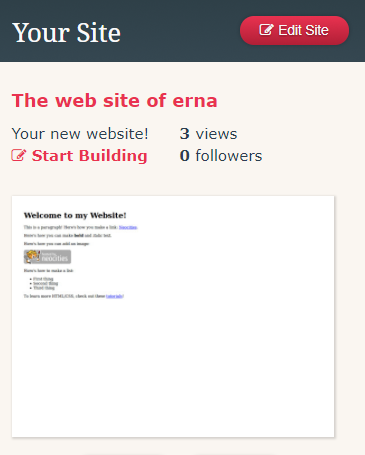
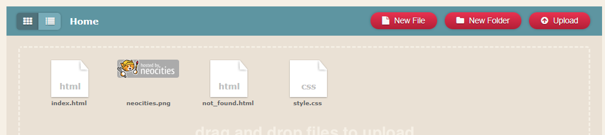
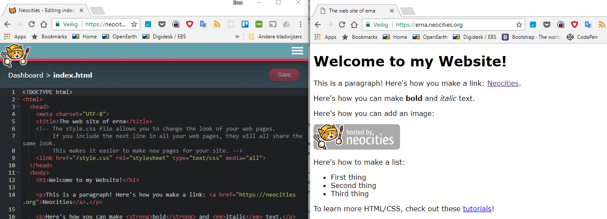

Voordat we echt aan de slag kunnen, moeten we een omgeving hebben waarin we een website kunnen maken. Als je aan het werk bent, komt hij ook meteen online te staan!

1. Ga naar [www.neocities.org](www.neocities.org) en vul je gegevens in onder `Sign up for free`.

   * Kies een username. Deze gebruik je later om je website te openen in je browser.
     
   * Je hobby's \(hobbies\) invullen mag, maar hoeft niet.
   * Kies een wachtwoord dat je kunt onthouden.
   * Vul een e-mailadres in waarvan je de mail kunt lezen. Soms wordt er een inlogcode gemaild die je later moet invullen.

2. Als je alles hebt ingevuld, klik je op `Create my site`.

3. Je hebt nu een account aangemaakt, zodat je altijd kunt inloggen en je website kunt aanpassen.

4. Als je bent ingelogd, zie je aan de rechterkant van het scherm informatie over je site.  
   

5. Er is een eenvoudige website voor je gemaakt. Hierdoor hoef je niet met een helemaal lege pagina te beginnen. Als je klikt op de thumbnail \(kleine afbeelding\) van de website, wordt de website geopend.

6. Het tabblad met de website laten we open staan. Hierin kunnen we straks meteen zien hoe je wijzigingen er op je site uitzien.

7. In een nieuw tabblad van je webbrowser, ga je opnieuw naar [www.neocities.org](www.neocities.org).

8. In het zelfde blokje `Your site` aan de rechterkant van je scherm, klik je op `Edit site`.

9. Nu zie je uit welke bestanden je website bestaat.  
   

10. Beweeg met je muis over index.html. Dit is de belangrijkste pagina van elke website. Klik op `Edit`.

11. Er wordt nu een pagina geopend met een editor. Hierin zie je wat er in `index.html` staat en je dit bestand veranderen.

12. We zijn nu bijna klaar om te beginnen. Om handig te kunnen werken, zet je de tabbladen met de editor en je site naast elkaar.  
    

13. Nu zijn we klaar aan de slag te gaan!

