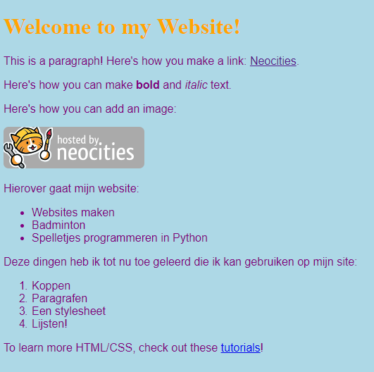

1. Zou het niet leuk zijn dat als je een lijstje maakt, dat die er ook meteen uitziet als een echte lijst? Gelukkig zijn er HTML tags die juist dat doen! Open het bestand `index.html`. Daarin zie je de volgende tekst staan:

   ```html
   <p>Here's how to make a list:</p>

    <ul>
      <li>First thing</li>
      <li>Second thing</li>
      <li>Third thing</li>
    </ul>
   ```

2. Kijk eens naar je website en zoek dezelfde tekst. Zie je hoe van deze tekst een mooie lijst is gemaakt?
> De hele lijst staat tussen de tags `<ul> </ul>`. Die zorgen ervoor dat de lijst er goed uitziet. "ul" staat voor **unordered list**, willekeurige lijst. Alle dingen in de lijst moeten tussen `<li> </li>` tags staan. "li" staat voor **list item**, item op je lijst.

3. Verander de dingen op de lijst in dingen waarover je wilt vertellen op je website. Dit kan van alles zijn wat je leuk vindt! Je kunt extra dingen toevoegen door nieuwe regels met  `<li> </li>` te typen.

4. Wat nu als je een genummerde lijst wilt maken? Dat gaat bijna net zo, alleen in plaats van `ul` gebruik je `ol`. Dit staat voor **ordered list**, opsomming. Voeg de volgende tekst toe onder de lijst met dingen waarover je website gaat.

   ```html
   <p>Deze dingen heb ik tot nu toe geleerd die ik kan gebruiken op mijn website: </p> 

    <ol>
      <li>Koppen</li>
      <li>Paragrafen</li>
      <li>Een stylesheet</li>
      <li>Lijsten!</li>
    </ol>
   ```

5. Save en refresh je site. Lijkt die van jou hierop?



