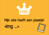

1. Nu je meerdere pagina's hebt gemaakt, wil je natuurlijk ook dat naar je andere pagina's kunt gaan. Hiervoor heb je een **link** nodig. Als je een link wilt maken, gebruik je daarvoor de `<a> </a<>`tags. Kun je de link naar Neocities terugvinden in `index.html`? Die link ziet er als volgt uit:
   ```html
   <a href="https://neocities.org">Neocities</a>
   ```

   > Het attribuut **href** vertelt het adres van de link aan de browser. Zoals geldt voor alle attributen, moet de waarde tussen aanhalingstekens staan.
2. Open `index.html` en voeg de links naar je nieuwe pagina's toe aan je lijst met waarover je website gaat. Verander de tekst tussen de aanhalingstekens en let op dat de naam precies gelijk is aan de namen van de bestanden die je gemaakt hebt. Voeg ook een link toe naar je homepage
   ```html
    <ul>
      <li><a href="index.html">Home</a></li>
      <li><a href="websites.html">Websites maken</a></li>
      <li><a href="badminton.html">Badminton</a></li>
      <li><a href="python.html">Spelletjes programmeren in Python</a></li>
    </ul>
   ```
3. Sla op en refresh je website. Je kunt nu naar je nieuwe pagina's gaan!

4. Links naar andere websites zien er net zo uit. Type de code voor een nieuwe link die je wilt toevoegen, waarbij je nog niets invult voor **href**.

   ```html
   <p>
    Via <a href="">CoderDojo Delft </a> heb ik geleerd hoe je een website maakt.
   </p>
   ```

5. Ga naar de website waar naartoe je een link wilt maken. Klik in de adresbalk en selecteer de hele tekst. Dit is het hele adres van de pagina waar je bent. Druk tegelijk **Ctrl** en **C** in om deze tekst te **kopiëren**.  
   

6. Ga nu terug naar je code. Klik tussen de aanhalingstekens en **plak** het adres hier door **Ctrl** en **V** tegelijk in te drukken. Save en refresh en probeer de link!

7. Net als alle andere tekst, kun je een link een andere kleur geven in je stylesheet. Open het bestand `style.css` en voeg onderstaande verzameling regels toe. Kies zelf een leuke kleur!

   ```css
   a {
    color: green;
   }
   ```

   > Merk op dat de selector voor links `a` is.

8. Save en refresh je pagina. Lijkt jouw pagina hier op?  
   


 

 
 

 

  


