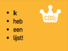
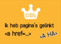
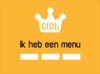

1. Je kunt je navigatie menu eruit laten zien als een cool menu door **CSS** regels toe te voegen in het stylesheet.

2. Weet je nog in welk bestand je stylesheet staat? Open `style.css` in de editor. Ga naar het einde van het bestand en voeg de volgende code toe:

   ```css
   nav ul {
     background-color: tomato;
   }
   ```

   > Is het je opgevallen dat de **\*twee selectors** gebruikt hebt in plaats van maar één? Als je alleen `ul` zou gebruiken, zou de regel voor _alle_ willekeurige lijsten op je website gelden. Door de `nav` selector toe te voegen, wordt deze regel alleen gebruikt voor de lijsten tussen de `nav` tags.

3. Sla op, herlaad je pagina en kijk hoe het eruit ziet.

4. De bolletjes voor elk item in je lijst zijn niet zo mooi in een menu. Die gaan we laten verdwijnen. Open weer `style.css` en voeg het volgende toe onderaan het bestand. Doe dit weer een op een nieuwe regel, zodat het niet per ongeluk in een andere verzameling regels terecht komt.

   ```css
   nav ul li {
    list-style-type: none;
   }
   ```

   > Merk op dat deze verzameling regels **drie** selectors heeft. Deze regels gelden voor alle `li` elementen in een `ul` lijst binnen een `nav` sectie. Pffff!

5. Laten we er een horizontale lijst \(naast elkaar\) in plaats van een verticale lijst \(onder elkaar\) van maken. Doe dit door de regel `display: inline;` toe te voegen aan de verzameling regels. Voeg ook de eigenschappen `margin-right`en `margin-left` toe zodat er wat ruimte is tussen de verschillende items in het menu. Zien jouw regels er nu ook zo uit?

   ```css
   nav ul li {
     list-style-type: none;
     display: inline;
     margin-right: 10px;
     margin-left: 10px;
   }
   ```

   > Wist je nog dat `10px` 10 pixels betekent?

6. Wat vind je ervan om het menu zo te veranderen zodat je kunt zien op welke pagina je bent? Dit doen we niet in de stylesheet.

7. Laten we beginnen met de homepage. Open `index.html` in de editor. Verwijder de link en de tags rond het woord "Home", zodat het item in de lijst alleen nog een tekst is tussen `<li> </li>` tags: `<li>Home</li>`.

8. Open nu één voor één je andere bestanden en doe hetzelfde: verwijder de link tags van de pagina die je aan het veranderen bent. Bijvoorbeeld voor een pagina over het maken van websites, verwijder de link zoals hieronder, enzovoort.  
   

9. Sla al je pagina's op en kijk eens hoe het eruit ziet. Zie je hoe de naam van de pagina waarop je bent nu gewone tekst is in plaats van een link?


 

 
 




