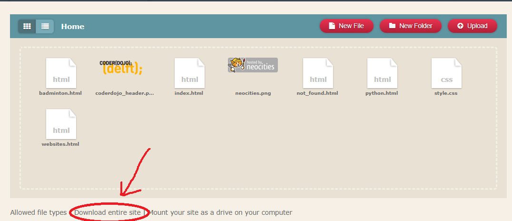
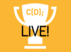
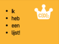
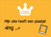
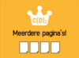
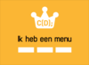
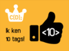

Je website staat nu online. Misschien wil je uiteindelijk je website wel downloaden, zodat je ook de bestanden thuis op je computer hebt staan.

1. Ga naar je dashboard. Onderaan staat daar de optie `Download entire site`. Klik hierop en kies een plaats waar je je bestanden wilt opslaan.  
   

2. Je hebt nu een zip-bestand opgeslagen. Hierin staan alle bestanden van je site.

3. Pak het zip-bestand uit en zoek het bestand `index.html`. Weet je nog dat dit je homepage is? Dubbel-klik op dit bestand en het wordt automatisch geopend in een **browser**. Klik op de links en zie dat het werkt.

4. Je kunt de website ook op je eigen computer aanpassen. Als je dat doet, kun je hem alleen niet meteen aan al je vrienden laten zien, je moet hem dan nog online zetten, bijvoorbeeld uploaden naar Neocities.

5. Je website kun je bewerken in een tekst editor zoals Kladblok/Notepad, Notepad++ of Sublime Text. In deze laatste twee zie je dat de tags een ander kleurtje krijgen, net als in de editor van Neocities.

> Zoals je hebt geleerd, bestaat een web pagina alleen uit tekst met tags om de tekst onder controle te houden. Je hebt nu gezien dat de web pagina en de code eigenlijk hetzelfde bestand: afhankelijk van waarin je het opent, in een **browser** of een **tekst editor** zie je de **website** of de **code**.

  
 

 
 

